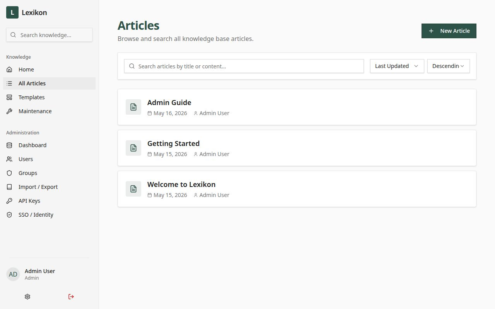
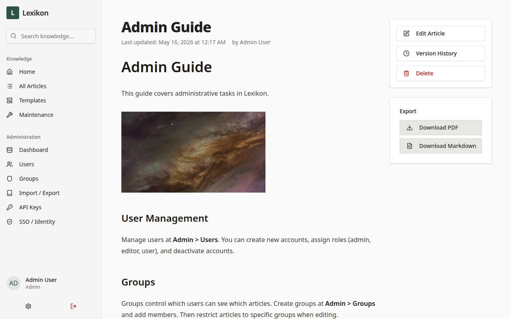
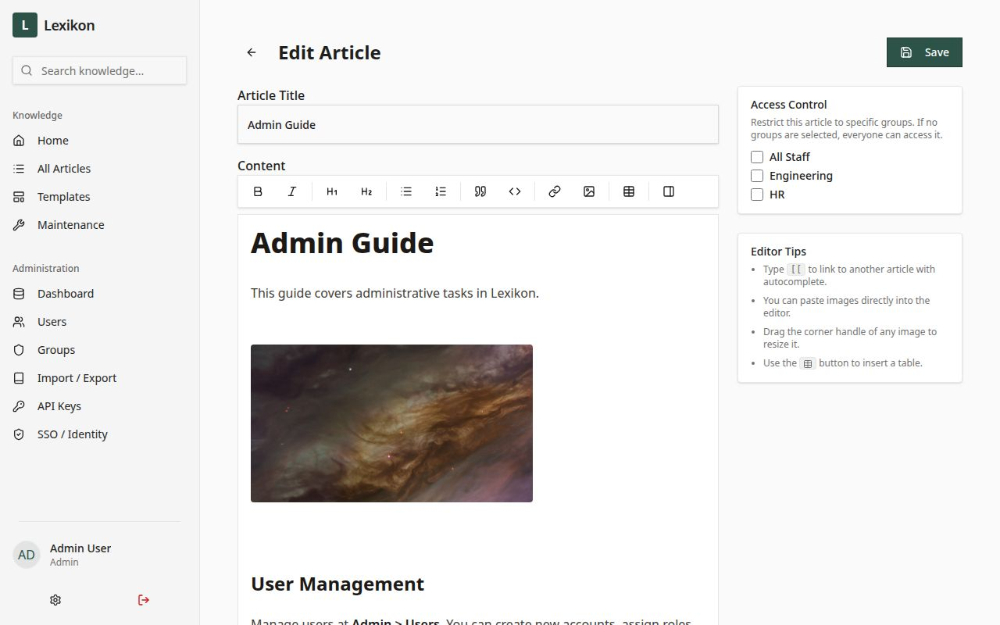
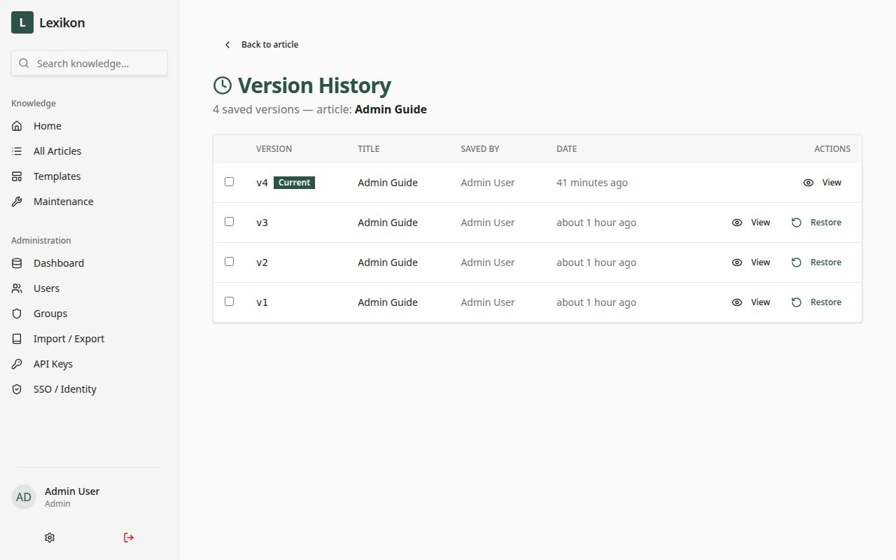
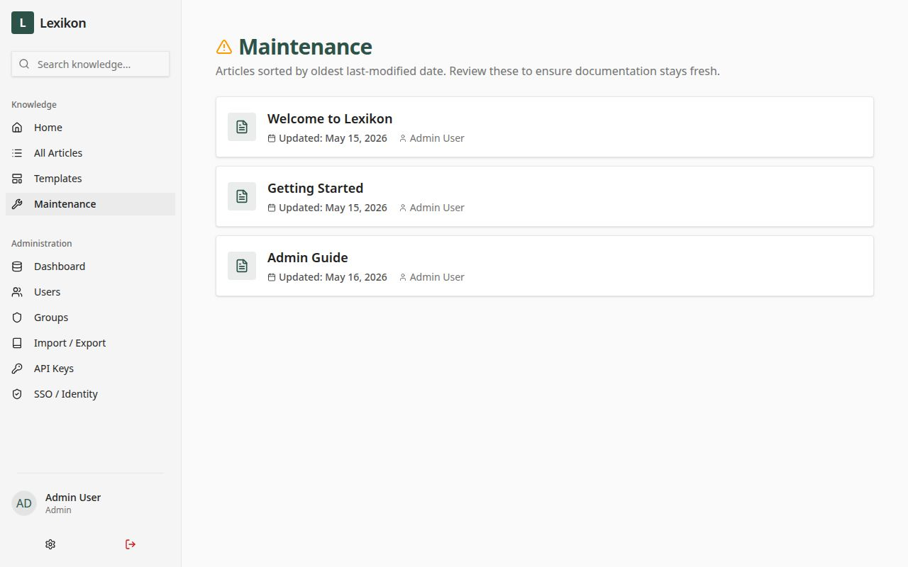
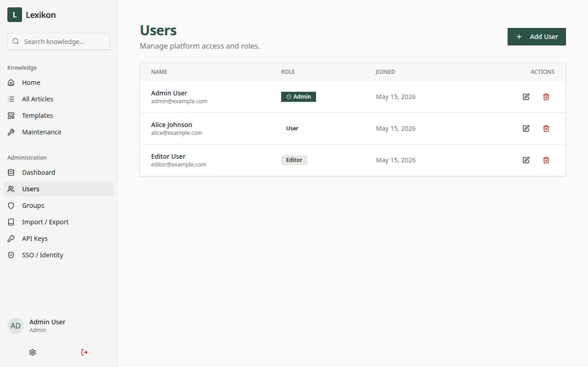
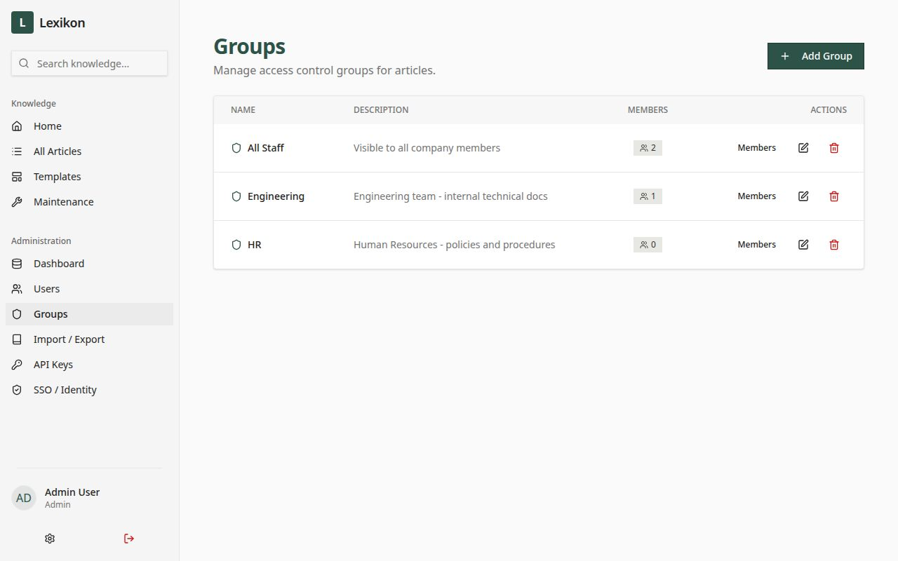
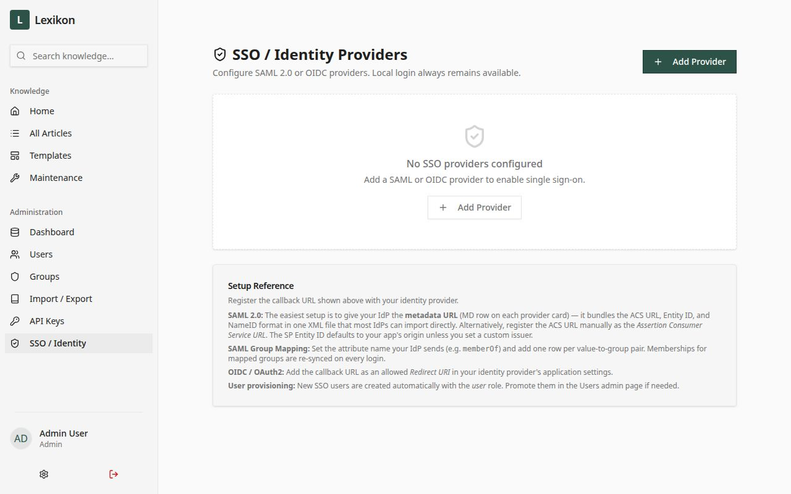
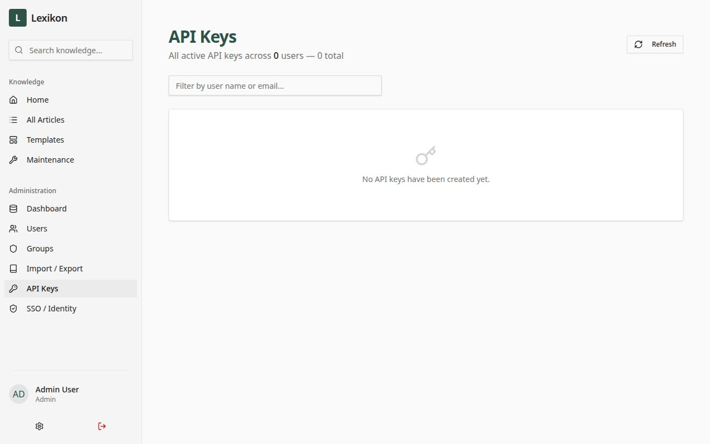

# Lexikon

A self-hostable, wiki-style knowledge base. React + Vite frontend, Express + PostgreSQL backend, packaged as a single Docker image.

---

## Features

### Editing
- **WYSIWYG editor** powered by TipTap — headings, bold/italic, lists, blockquotes, code blocks, tables (resizable), and image upload with drag-to-resize
- **`[[Wikilinks]]`** with inline autocomplete for linking between articles
- **InfoBox** sidebar panels for structured metadata inside articles
- **Templates** — save reusable content layouts and insert them at the cursor

### Content management
- **Version history** — every save is snapshotted; browse and restore any previous version
- **Backlinks** — each article shows which other articles link to it
- **Maintenance view** — lists articles sorted by oldest update; flags anything untouched for 6+ months as "Needs Review"
- **Bulk import** — upload a single `.md` file, a folder, or a full ZIP archive (Markdown + images + metadata)
- **Bulk export** — download the entire knowledge base as a ZIP (Markdown files + images + metadata JSON)
- **Single-article export** — download any article as Markdown or PDF

### Access control
| Role | Can do |
|---|---|
| `admin` | Everything — user/group/SSO management, import/export, all articles |
| `editor` | Create and edit articles and templates |
| `user` | Read articles they have been granted access to |

- Articles can be restricted to one or more **groups**; unrestricted articles are visible to all authenticated users
- Admins always bypass group restrictions
- SAML group attributes can be **automatically synced** to Lexikon groups on every login

### Single Sign-On
- **SAML 2.0** and **OIDC / OAuth2** — multiple providers can be active simultaneously
- **Just-in-time provisioning** — accounts are created automatically on first SSO login
- **SAML group mapping** — map IdP attribute values (e.g. `memberOf`) to Lexikon groups; memberships are reconciled on every login
- **SP metadata endpoint** — `/api/auth/saml/:id/metadata` returns standard XML for one-click IdP import
- Local password login always remains available as a fallback

### API
- **REST API** with Swagger UI at `/api/docs`
- **Bearer token auth** — generate tokens with optional expiry from your profile settings
- All article CRUD, search, group management, user management, and admin operations are available over the API

---

## Screenshots

**Article list**


**Reading an article** — with export, edit, and version history actions in the sidebar


**WYSIWYG editor** — TipTap toolbar, inline access control, and editor tips


**Version history** — browse every saved snapshot and restore any version


**Maintenance view** — articles sorted by oldest update date


**User management**


**Group management** — create groups, set descriptions, manage members


**SSO / Identity Providers** — configure SAML 2.0 or OIDC providers


**API Keys** — per-user bearer tokens with optional expiry


---

## Self-hosting with Docker

### Prerequisites

- [Docker](https://docs.docker.com/get-docker/) 24+
- [Docker Compose](https://docs.docker.com/compose/) v2

### Quick start

```bash
# 1. Clone the repository
git clone https://github.com/<your-org>/lexikon.git
cd lexikon

# 2. Create your environment file
cp .env.example .env
```

Edit `.env` — at minimum you must set `SESSION_SECRET` and `POSTGRES_PASSWORD`:

```bash
# Generate a secure session secret
node -e "console.log(require('crypto').randomBytes(48).toString('hex'))"
```

```bash
# 3. (First boot) create the initial admin account
#    Add these to .env — they are safe to remove after the first start
RUN_SEED=true
SEED_ADMIN_EMAIL=admin@example.com
SEED_ADMIN_PASSWORD=your-strong-password
```

```bash
# 4. Start everything
docker compose up -d

# 5. Open http://localhost:3000
```

After logging in, remove the `RUN_SEED` / `SEED_ADMIN_*` lines from `.env` and run `docker compose up -d` again.

### docker-compose.yml overview

```
┌─────────┐     ┌─────────┐     ┌─────┐
│   db    │◄────│ migrate │◄────│ app │
│postgres │     │ drizzle │     │     │
└─────────┘     └─────────┘     └─────┘
```

- **`db`** — PostgreSQL 16 with a persistent named volume (`pgdata`)
- **`migrate`** — runs `drizzle-kit push` against the database and exits; `app` waits for it to succeed before starting
- **`app`** — the compiled Lexikon bundle (API + static frontend) listening on port 3000

### Environment variables

| Variable | Required | Default | Description |
|---|---|---|---|
| `SESSION_SECRET` | Yes | — | Long random string for signing session cookies |
| `POSTGRES_PASSWORD` | Yes | `changeme` | Password for the `lexikon` Postgres user |
| `DATABASE_URL` | No | derived | Full connection string — override if using an external DB |
| `PORT` | No | `3000` | Host port mapped to the container |
| `CORS_ORIGIN` | No | — | Comma-separated allowed CORS origins (e.g. `https://wiki.example.com`) |
| `APP_BASE_URL` | No | — | Public URL of the deployment — used in SSO callback/metadata URLs |
| `RUN_SEED` | No | — | Set to `true` on first boot to create the initial admin account |
| `SEED_ADMIN_EMAIL` | No | — | Email for the seeded admin account |
| `SEED_ADMIN_PASSWORD` | No | — | Password for the seeded admin account |

Full reference: [`.env.example`](.env.example)

### Using pre-built images

Release images are published to GitHub Container Registry on every `v*.*.*` tag:

```bash
docker pull ghcr.io/<your-org>/lexikon:latest
```

To use a pre-built image, replace `build: .` in `docker-compose.yml` with:

```yaml
image: ghcr.io/<your-org>/lexikon:latest
```

### Running migrations manually

`docker compose up` always runs migrations before starting the app. To run them in isolation (e.g. during a rolling upgrade):

```bash
docker compose run --rm migrate \
  pnpm --filter @workspace/db run push
```

### Reverse proxy

Lexikon serves both the API and the static frontend from a single port. A minimal nginx config:

```nginx
server {
    listen 443 ssl;
    server_name wiki.example.com;

    location / {
        proxy_pass         http://localhost:3000;
        proxy_set_header   Host $host;
        proxy_set_header   X-Real-IP $remote_addr;
        proxy_set_header   X-Forwarded-For $proxy_add_x_forwarded_for;
        proxy_set_header   X-Forwarded-Proto $scheme;
        client_max_body_size 50m;  # for image uploads
    }
}
```

Set `APP_BASE_URL=https://wiki.example.com` in `.env` so SSO callback and metadata URLs are generated with the correct public hostname.

---

## Configuring SSO

SSO providers are managed in **Admin → SSO / Identity**. Local password login is always available regardless of SSO configuration.

### SAML 2.0

1. Go to **Admin → SSO / Identity → Add Provider** and choose **SAML 2.0**
2. Fill in:
   - **IdP SSO URL** — the `SingleSignOnService` URL from your IdP
   - **SP Entity ID / Issuer** — defaults to your app's origin; must match what you register with the IdP
   - **IdP Certificate (PEM)** — the X.509 signing certificate from your IdP
3. Save the provider (it starts disabled)
4. Copy the **metadata URL** from the provider card (labelled `MD`) and import it into your IdP — this auto-registers the ACS URL, Entity ID, and NameID format. Alternatively, register the **ACS URL** (labelled `ACS`) manually as the Assertion Consumer Service URL in your IdP
5. Enable the toggle once the IdP is configured

**Group attribute mapping**

If your IdP sends group membership in a SAML attribute (e.g. `memberOf`, `groups`), you can sync those to Lexikon groups automatically:

1. Open the SAML provider for editing
2. In **Group Attribute Mapping**, enter the attribute name your IdP uses (e.g. `memberOf`)
3. Add one row per value: left column is the exact SAML attribute value, right column is the Lexikon group to map it to
4. Save — on every subsequent login, Lexikon will add and remove the user from the mapped groups to match what the IdP asserts. Groups not referenced in the mapping are never touched.

**Common IdP-specific notes**

| IdP | Attribute name | Notes |
|---|---|---|
| Azure AD / Entra | `http://schemas.microsoft.com/ws/2008/06/identity/claims/groups` | Contains group object IDs by default; switch to group names in the token config if preferred |
| Okta | `groups` | Add the Groups attribute in the SAML app's Attribute Statements |
| Google Workspace | N/A | Google SAML does not send group attributes |
| Keycloak | `groups` | Enable the "Group Membership" mapper in the client |

### OIDC / OAuth2

1. Go to **Admin → SSO / Identity → Add Provider** and choose **OIDC / OAuth2**
2. Fill in:
   - **Issuer / Discovery URL** — the base OIDC issuer URL (Lexikon appends `/.well-known/openid-configuration` to discover endpoints). Examples:
     - Google: `https://accounts.google.com`
     - Azure AD: `https://login.microsoftonline.com/<tenant-id>/v2.0`
     - Keycloak: `https://keycloak.example.com/realms/<realm>`
   - **Client ID** and **Client Secret** — from your IdP's application registration
   - **Scopes** — space-separated; defaults to `openid email profile`
3. Register the **callback URL** (shown on the provider card) as an allowed Redirect URI in your IdP
4. Enable the toggle

---

## API

The full interactive reference is available at `/api/docs` (Swagger UI) when the server is running.

### Authentication

**Session cookie** (browser) — log in via `POST /api/auth/login` and the server sets a `connect.sid` cookie automatically.

**Bearer token** (scripts / integrations):

1. Log in and go to your profile → **API Tokens → New Token**
2. Copy the token (it is shown only once)
3. Pass it in every request:

```
Authorization: Bearer <token>
```

Tokens can have an optional expiry date and can be revoked at any time from the profile page.

### Key endpoints

#### Articles

| Method | Path | Description |
|---|---|---|
| `GET` | `/api/articles` | List all articles the caller can access |
| `GET` | `/api/articles/:slug` | Get a single article by slug |
| `POST` | `/api/articles` | Create an article (`editor` or `admin`) |
| `PATCH` | `/api/articles/:slug` | Update an article |
| `DELETE` | `/api/articles/:slug` | Delete an article (`admin`) |
| `GET` | `/api/articles/:slug/versions` | List version history |
| `GET` | `/api/articles/:slug/versions/:id` | Get a specific version |
| `GET` | `/api/articles/:slug/backlinks` | Articles that link to this one |
| `GET` | `/api/articles/:slug/export/markdown` | Download as Markdown |
| `GET` | `/api/articles/:slug/export/pdf` | Download as PDF |

#### Search

| Method | Path | Description |
|---|---|---|
| `GET` | `/api/search?q=…` | Full-text search across all accessible articles |

#### Groups

| Method | Path | Description |
|---|---|---|
| `GET` | `/api/groups` | List all groups |
| `POST` | `/api/groups` | Create a group (`admin`) |
| `PATCH` | `/api/groups/:id` | Update a group (`admin`) |
| `DELETE` | `/api/groups/:id` | Delete a group (`admin`) |
| `GET` | `/api/groups/:id/members` | List group members |
| `POST` | `/api/groups/:id/members` | Add a member (`admin`) |
| `DELETE` | `/api/groups/:id/members/:userId` | Remove a member (`admin`) |

#### Users

| Method | Path | Description |
|---|---|---|
| `GET` | `/api/users` | List all users (`admin`) |
| `PATCH` | `/api/users/:id` | Update a user's role or details (`admin`) |
| `DELETE` | `/api/users/:id` | Delete a user (`admin`) |

#### Import / Export (admin only)

| Method | Path | Description |
|---|---|---|
| `GET` | `/api/admin/export` | Download full knowledge base as ZIP |
| `POST` | `/api/admin/import` | Upload a `.md` file or ZIP archive |

#### API tokens

| Method | Path | Description |
|---|---|---|
| `GET` | `/api/tokens` | List your tokens (metadata only) |
| `POST` | `/api/tokens` | Create a new token |
| `DELETE` | `/api/tokens/:id` | Revoke a token |

### Example: create an article with curl

```bash
TOKEN="your-api-token"
BASE="https://wiki.example.com"

curl -s -X POST "$BASE/api/articles" \
  -H "Authorization: Bearer $TOKEN" \
  -H "Content-Type: application/json" \
  -d '{
    "title": "Getting Started",
    "slug": "getting-started",
    "content": "<p>Welcome to Lexikon!</p>"
  }'
```

### Example: export the full knowledge base

```bash
curl -s -O -J \
  -H "Authorization: Bearer $TOKEN" \
  "$BASE/api/admin/export"
# saves lexikon-export-<date>.zip in the current directory
```

---

## Development

```bash
# Install dependencies
pnpm install

# Push the DB schema (requires DATABASE_URL)
pnpm --filter @workspace/db run push

# Start the API server  (default port 8080)
pnpm --filter @workspace/api-server run dev

# Start the frontend   (default port 5173)
pnpm --filter @workspace/knowledge-base run dev
```

See [`replit.md`](replit.md) for full stack details, architecture decisions, and a guide to where things live.

---

## License

MIT
