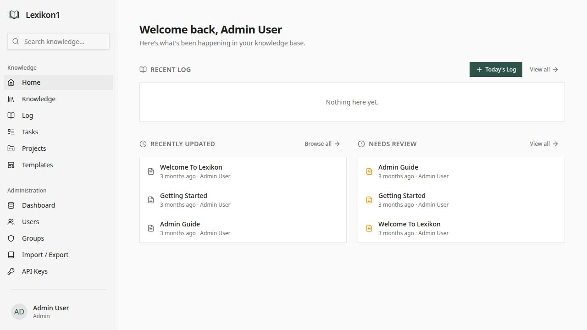
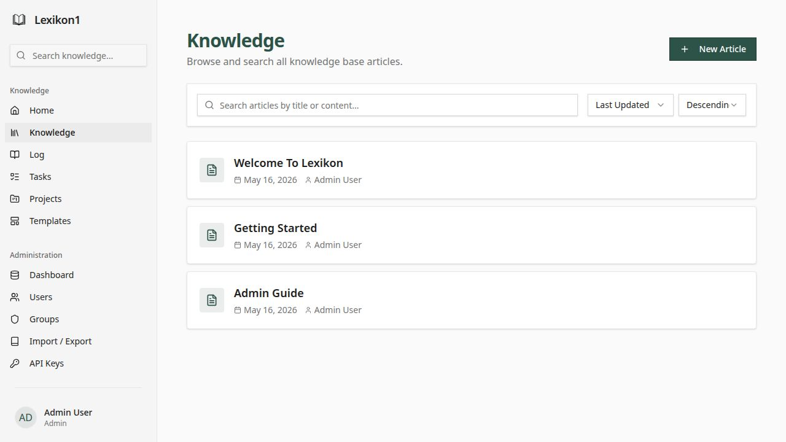
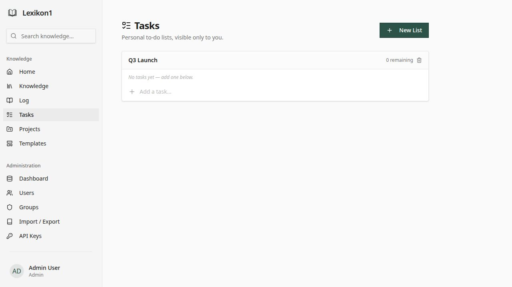
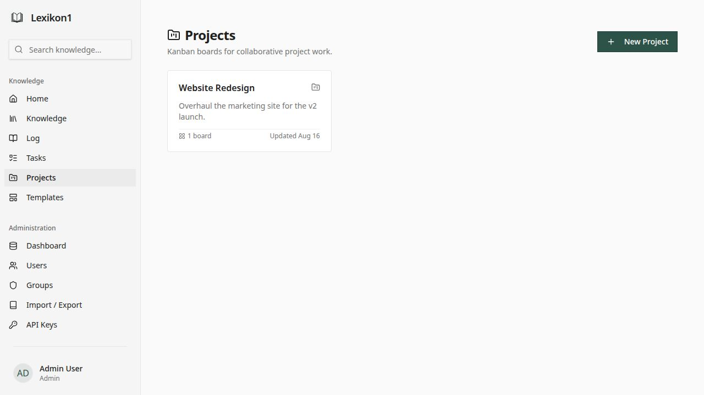
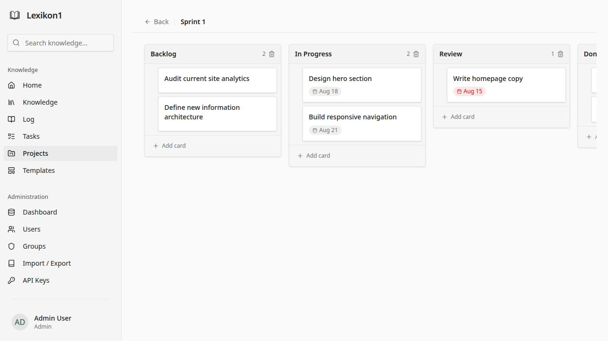
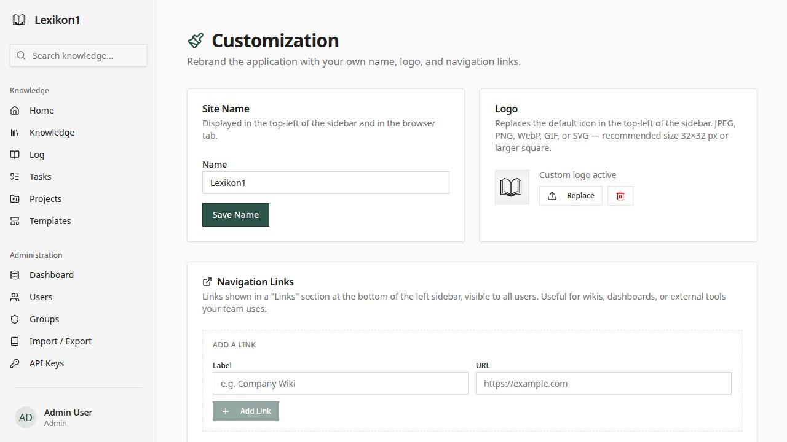

# Memex

A self-hostable wiki and productivity hub with a React frontend and Express backend. Combine a rich knowledge base with personal task management and collaborative Kanban project boards.

---

## Features

- **Dashboard** — home page showing recent log entries, recently updated articles, and a "Needs Review" list (oldest by last-updated date)
- **Articles** — rich-text editing (TipTap), wikilinks, backlinks, version history, tags, PDF/Markdown export
- **Log Entries** — optional date-titled journal, kept separate from the main article list; togglable by admins
- **Tasks** — personal to-do lists with multiple named lists, checkbox items, and completed-task collapse; visible only to you; togglable by admins
- **Projects** — collaborative Kanban boards: create Projects, add Boards, define Columns, drag-and-drop Cards with due dates and member assignment; share Projects with Groups; togglable by admins
- **Groups & access control** — restrict articles and projects to specific groups; role-based access (admin / editor / viewer)
- **Tags** — colour-coded labels on articles; filterable in the article list
- **Edit locking** — warns a second editor when someone is already editing an article
- **API tokens** — long-lived bearer tokens for scripting and integrations (Settings → API Keys)
- **MCP server** — exposes the KB as tools for Claude Desktop, Cursor, and other MCP-compatible clients
- **Android companion app** — read-only Expo app for offline article access and full-text search

---

## Screenshots

### Dashboard

*The home dashboard surfaces your recent log entries, recently updated articles, and articles that haven't been touched in a while (Needs Review).*

### Knowledge Base

*Browse, search, and filter all articles. Editors can create and publish articles with full rich-text editing, wikilinks, tags, and version history.*

### Tasks

*Personal to-do lists, visible only to you. Create multiple named lists, add tasks, check them off, and collapse completed items.*

### Projects (Kanban)

*Projects are collaborative Kanban workspaces that can be shared with Groups. Each project holds multiple boards.*

### Kanban Board

*Boards have columns with drag-and-drop cards. Cards support due dates (highlighted red when overdue), member assignment, and rich descriptions.*

### Admin Customization

*Admins can rename the site, upload a logo, manage navigation links, and toggle individual features on or off.*


---

## Run & Operate

```bash
pnpm --filter @workspace/api-server run dev       # API server (port from $PORT)
pnpm --filter @workspace/knowledge-base run dev   # React SPA dev server
pnpm --filter @workspace/mcp-server run dev       # MCP server (stdio, for local testing)
pnpm run typecheck                                 # full typecheck across all packages
pnpm run build                                     # typecheck + build all packages
pnpm --filter @workspace/api-spec run codegen     # regenerate API hooks from OpenAPI spec
pnpm --filter @workspace/db run push              # push DB schema changes (dev only)
```

Required env: `DATABASE_URL` (Postgres connection string), `SESSION_SECRET`

---

## Self-Hosting with Docker

Memex ships as a single Docker image (multi-platform: `linux/amd64` and `linux/arm64`) bundling both the API server and the pre-built frontend SPA. No Node.js or pnpm required on the host.

### Prerequisites

- [Docker](https://docs.docker.com/get-docker/) 24+
- [Docker Compose](https://docs.docker.com/compose/) v2

### Quick start

```bash
# 1. Clone the repository
git clone https://github.com/<your-org>/memex.git
cd memex

# 2. Create your environment file
cp .env.example .env
#    Edit .env — at minimum set SESSION_SECRET and POSTGRES_PASSWORD.

# 3. Start everything (Postgres + migration + app)
docker compose up -d

# 4. Open http://localhost:3000
```

On first boot, set `RUN_SEED=true` in `.env` together with `SEED_ADMIN_EMAIL` and `SEED_ADMIN_PASSWORD` to create the initial admin account. Remove the seed variables after the first successful start.

### Environment variables

See `.env.example` for the full list. Minimum required:

| Variable | Description |
|---|---|
| `SESSION_SECRET` | Long random string for signing session cookies |
| `POSTGRES_PASSWORD` | Password for the `memex` Postgres user |
| `DATABASE_URL` | Postgres connection string (auto-set by compose) |

### Schema migrations

`docker compose up` automatically runs `drizzle-kit push` before starting the app. For upgrades with schema conflicts, run the migration manually:

```bash
docker compose run --rm migrate \
  pnpm --filter @workspace/db run push
```

### Published images

```bash
docker pull ghcr.io/<your-org>/memex:latest   # amd64 + arm64
```

---

## Tasks

Personal to-do lists, visible only to the user who created them. Each user can create multiple named lists and add any number of tasks to each.

**Behaviour:**
- Tasks can be toggled complete; completed tasks collapse under a "N completed" disclosure at the bottom of the list
- List names are inline-editable (click the pencil icon)
- Feature can be disabled site-wide by admins (Admin → Customization → Tasks)

**API:**

| Method | Path | Description |
|--------|------|-------------|
| `GET` | `/api/tasks/lists` | All lists with embedded tasks for the current user |
| `POST` | `/api/tasks/lists` | Create a list — body: `{ name }` |
| `PATCH` | `/api/tasks/lists/:id` | Rename a list — body: `{ name }` |
| `DELETE` | `/api/tasks/lists/:id` | Delete a list and all its tasks |
| `POST` | `/api/tasks/:listId` | Add a task — body: `{ title }` |
| `PATCH` | `/api/tasks/:taskId/toggle` | Toggle a task's completed state |
| `DELETE` | `/api/tasks/:taskId` | Delete a task |

---

## Projects & Kanban Boards

Collaborative Kanban workspaces. A **Project** contains one or more **Boards**; each Board has **Columns** (e.g. Backlog, In Progress, Done); each Column holds **Cards**.

**Behaviour:**
- Cards support due dates (rendered red when overdue) and member assignment from users with project access
- Cards are draggable within and between columns
- Projects can be shared with Groups — all group members gain read/write access
- Feature can be disabled site-wide by admins (Admin → Customization → Projects)

### Projects API

| Method | Path | Description |
|--------|------|-------------|
| `GET` | `/api/projects` | List all accessible projects (owned + shared via groups) |
| `POST` | `/api/projects` | Create a project — body: `{ name, description? }` |
| `GET` | `/api/projects/:id` | Project detail with boards, shared groups, and `isOwner` flag |
| `PATCH` | `/api/projects/:id` | Rename / redescribe (owner or admin) — body: `{ name?, description? }` |
| `DELETE` | `/api/projects/:id` | Delete project and all boards/columns/cards (owner or admin) |
| `GET` | `/api/projects/:id/members` | Users with access to this project (for card member assignment) |
| `POST` | `/api/projects/:id/groups` | Share project with a group — body: `{ groupId }` |
| `DELETE` | `/api/projects/:id/groups/:groupId` | Remove group access |

### Boards API

| Method | Path | Description |
|--------|------|-------------|
| `POST` | `/api/projects/:projectId/boards` | Create a board — body: `{ name }` |
| `GET` | `/api/boards/:boardId` | Board with all columns and cards (including card members) |
| `PATCH` | `/api/boards/:boardId` | Rename board — body: `{ name }` |
| `DELETE` | `/api/boards/:boardId` | Delete board and all columns/cards |
| `PATCH` | `/api/boards/:boardId/cards/reorder` | Bulk reorder / move cards across columns — body: `{ columns: [{ columnId, cardIds[] }] }` |

### Columns API

| Method | Path | Description |
|--------|------|-------------|
| `POST` | `/api/boards/:boardId/columns` | Create a column — body: `{ name }` |
| `PATCH` | `/api/columns/:columnId` | Rename column — body: `{ name }` |
| `DELETE` | `/api/columns/:columnId` | Delete column and all its cards |

### Cards API

| Method | Path | Description |
|--------|------|-------------|
| `POST` | `/api/columns/:columnId/cards` | Create a card — body: `{ title }` |
| `PATCH` | `/api/cards/:cardId` | Update card — body: `{ title?, description?, dueDate? }` |
| `DELETE` | `/api/cards/:cardId` | Delete card |
| `POST` | `/api/cards/:cardId/members` | Assign a user — body: `{ userId }` |
| `DELETE` | `/api/cards/:cardId/members/:userId` | Unassign a user |

---

## Log Entries

An optional daily journal, separate from the main knowledge base. When enabled, a **Log** item appears in the sidebar. Log entries are date-titled and scoped to the user who created them.

- Enabled/disabled site-wide by admins (Admin → Customization → Log Entries); disabled by default
- The home dashboard shows your recent log entries when the feature is on
- A "Today's Log" button on the home page creates today's entry or jumps to it if it already exists

**API:** Log entries are articles with `isLogEntry: true`. Use the standard articles API with the log endpoints:

| Method | Path | Description |
|--------|------|-------------|
| `GET` | `/api/log` | List log entries for the current user (newest first) |
| `POST` | `/api/articles` | Create a log entry — include `isLogEntry: true` in the body |

---

## Admin Feature Toggles

Admins can enable or disable the Log, Tasks, and Projects features from **Admin → Customization**. Changes take effect immediately for all users — the sidebar item disappears and the API returns `403` for non-admins when a feature is off.

**API:**

```http
PATCH /api/admin/settings
Content-Type: application/json

{
  "logEntriesEnabled": true,
  "tasksEnabled": true,
  "projectsEnabled": false
}
```

**Read current settings (public):**

```http
GET /api/settings
→ { siteName, hasLogo, navLinks, logEntriesEnabled, tasksEnabled, projectsEnabled }
```

---

## MCP Server

The `artifacts/mcp-server` package exposes Memex as a set of tools for MCP-compatible LLM clients. Any authenticated user with an API token can connect.

**Available tools:**

| Tool | Description |
|------|-------------|
| `search_articles` | Keyword search across titles and content |
| `get_article` | Read the full body of an article by slug |
| `list_articles` | Browse all articles with optional tag filtering and pagination |
| `list_tags` | List all tags and their IDs |
| `get_backlinks` | Find every article that links to a given one |

**Setup (Claude Desktop):**

1. Create an API token in Memex → Settings → API Keys
2. Build the server: `pnpm --filter @workspace/mcp-server build`
3. Add to `~/Library/Application Support/Claude/claude_desktop_config.json`:

```json
{
  "mcpServers": {
    "memex": {
      "command": "node",
      "args": ["/path/to/artifacts/mcp-server/dist/index.js"],
      "env": {
        "MEMEX_URL": "http://your-memex-host:3000",
        "MEMEX_TOKEN": "your-api-token"
      }
    }
  }
}
```

See `artifacts/mcp-server/README.md` for full setup instructions including Cursor support.

---

## Tags

Tags are managed by admins (Admin → Tags) and applied to articles by editors. Each tag has a name and a colour. Articles can have multiple tags.

**API:**
- `GET /api/tags` — list all tags
- `POST /api/tags` — create a tag (admin only) — body: `{ name, color }`
- `PATCH /api/tags/:id` — rename or recolour (admin only)
- `DELETE /api/tags/:id` — delete (admin only)
- Tags are included on every article list and article detail response as `tags[]`
- `GET /api/articles?tagId=N` — filter article list by tag

---

## Edit Locking

When an editor opens an article for editing, Memex acquires a 2-minute TTL lock. A second editor sees a warning showing who holds the lock. The lock refreshes automatically every 90 seconds while the editor is open.

**API:**
- `GET /api/articles/:slug/lock` — check lock state
- `PUT /api/articles/:slug/lock` — acquire or refresh (returns `409` if locked by someone else)
- `DELETE /api/articles/:slug/lock` — release a lock

---

## Android Companion App

`artifacts/memex-mobile` is a read-only Expo (React Native) app that connects to any self-hosted Memex instance.

- Syncs all articles locally for full offline access and search
- Tag filter chips, pull-to-refresh, dark mode
- Enter your server URL and log in with your Memex credentials

A GitHub Actions workflow (`.github/workflows/build-android.yml`) builds a debug APK on every push to `main`.

---

## Stack

- pnpm workspaces, Node.js 24, TypeScript 5.9
- API: Express 5
- DB: PostgreSQL + Drizzle ORM
- Frontend: React 19 + Vite 7 + TipTap editor + @dnd-kit (drag-and-drop)
- Mobile: Expo (React Native) — managed workflow
- Validation: Zod, `drizzle-zod`
- API codegen: Orval (from OpenAPI spec in `lib/api-spec/openapi.yaml`)
- Build: esbuild (API), Vite (SPA)
- Docker: multi-platform image (`linux/amd64` + `linux/arm64`)

---

## Where things live

| Path | Contents |
|------|----------|
| `artifacts/api-server/src/` | Express API — routes, auth, middleware, seed |
| `artifacts/api-server/src/routes/projects.ts` | Projects, boards, columns, cards API |
| `artifacts/api-server/src/routes/tasks.ts` | Tasks and task lists API |
| `artifacts/api-server/src/routes/settings.ts` | Site settings and feature flag toggles |
| `artifacts/knowledge-base/src/` | React SPA — pages, components, hooks |
| `artifacts/knowledge-base/src/pages/board.tsx` | Kanban board with drag-and-drop |
| `artifacts/knowledge-base/src/pages/tasks.tsx` | Personal tasks page |
| `artifacts/knowledge-base/src/pages/projects.tsx` | Projects list page |
| `artifacts/knowledge-base/src/pages/project.tsx` | Project detail + group sharing |
| `artifacts/mcp-server/src/` | MCP server — API client wrapper + tool definitions |
| `artifacts/memex-mobile/` | Expo companion app |
| `lib/db/src/schema/` | Drizzle ORM schema (source of truth for DB shape) |
| `lib/db/src/schema/projects.ts` | projects, boards, columns, cards, card members |
| `lib/db/src/schema/tasks.ts` | task_lists, tasks tables |
| `lib/db/migrations/` | SQL migration files (applied in order) |
| `lib/api-spec/openapi.yaml` | OpenAPI spec (source of truth for API contract) |
| `lib/api-client-react/src/generated/` | Auto-generated React Query hooks — **do not edit** |
| `.github/workflows/docker-publish.yml` | GitHub Actions — builds multi-platform Docker image on push |
| `.github/workflows/build-android.yml` | GitHub Actions — builds Android APK on push |
| `docs/screenshots/` | README screenshots (regenerate with `node docs/take-screenshots.mjs`) |

---

## Architecture decisions

- **Single-container Docker**: The runtime image serves both `/api/*` (Express) and all other paths (React SPA) via `STATIC_DIR`. No separate nginx needed.
- **Multi-platform build**: The `builder` stage uses `--platform=$BUILDPLATFORM` so Node.js compilation always runs natively on the CI runner (amd64). Only the lightweight runtime stage adopts the target platform (arm64), making cross-platform builds fast without QEMU overhead.
- **esbuild bundle**: The API server compiles to a single `dist/index.mjs` with all deps inlined, except `archiver`, `unzipper`, and `pdfkit` (CJS packages that must remain external).
- **Session-based auth + bearer tokens**: `express-session` + `connect-pg-simple` for browser sessions; SHA-256-hashed bearer tokens in `api_tokens` for API/MCP access.
- **Feature flags in `site_settings`**: Log, Tasks, and Projects can be toggled on/off at runtime. The setting is a key-value row; absent key = feature enabled (Tasks/Projects default on; Log defaults off).
- **Edit locks in Postgres**: Lock state is a single row in `edit_locks` with a `lockedAt` timestamp; expiry is enforced at read time rather than via a background job.
- **DnD with @dnd-kit**: Kanban drag-and-drop uses the multi-container sortable pattern. Cards move in local state immediately (optimistic) and are persisted via a bulk reorder endpoint that accepts the full new column order.

---

## Gotchas

- The `vite.config.ts` requires `PORT` to be set even during `vite build`. The Dockerfile passes `PORT=4000` as a build-time env var.
- `drizzle-kit push` requires a TTY when there are unresolvable schema conflicts. On a fresh database this is never an issue.
- The MCP server uses stdio transport — it must be launched as a subprocess by the LLM client, not run as a standalone server.
- The Android APK produced by CI is a debug build (unsigned). For production distribution, set up signing keys in the GitHub Actions workflow.
- The `/api/dev/autologin` route (used by `docs/take-screenshots.mjs`) is only registered when `NODE_ENV !== "production"` and is never present in the Docker runtime image.

---

## Regenerating screenshots

```bash
# Requires: app running in dev mode, seed user at admin@example.com / admin123456
node docs/take-screenshots.mjs
# Saves PNGs to docs/screenshots/
```

---

## User preferences

_Populate as you build — explicit user instructions worth remembering across sessions._

## Pointers

- See the `pnpm-workspace` skill for workspace structure, TypeScript setup, and package details
